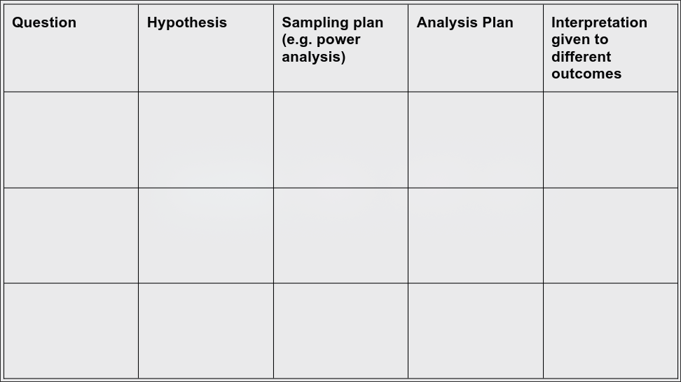
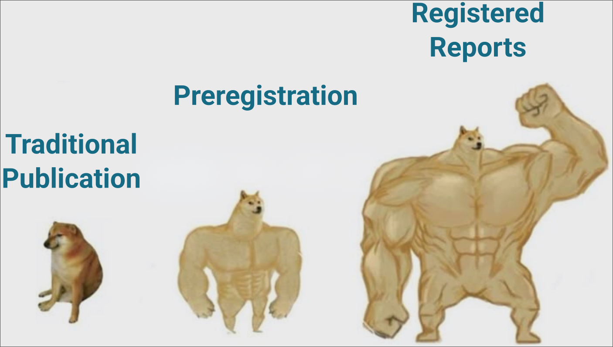

## 📲 Access the Slides Online

::: {style="text-align: center;"}
{width="45%"}\
[jdleongomez.github.io/unb-2026/open-science/](https://jdleongomez.github.io/unb-2026/open-science/){style="font-size: 70%;"}
:::

------------------------------------------------------------------------

## Outline

1.  **The Reproducibility Crisis**\
    The replication crisis, questionable research practices, and incentive structures.

2.  [**A Global Challenge**\
    Unequal access to reading and producing science, and where Brazil and Latin America stand.]{.fragment}

3.  [**What is Open Science?**\
    Definitions, motivation, and the pillars of open research practice.]{.fragment}

4.  [**Preregistration**\
    What it is, how it works, and why it improves research transparency.]{.fragment}

5.  [**Registered Reports**\
    A peer-review model that shifts the focus to study design and rigour.]{.fragment}

# Part 1: The Reproducibility Crisis {background-color="#2c3e50"}

------------------------------------------------------------------------

## 1.0 How is scientific knowledge actually built? {auto-animate="true"}

How do we know if two things are really related?

::: {.fragment .fade-in style="margin-top: 30px; font-size: 0.8em;"}
[Does my cat's meowing predict how many donuts I dream about?]{.is-accent}
:::

::: {.fragment .fade-in style="margin-top: 30px; font-size: 0.8em; text-align: center;"}
{width="22%"}\
(this is Electra, my ["cat"]{.is-accent})
:::

------------------------------------------------------------------------

## 1.0 How is scientific knowledge actually built? {auto-animate="true"}

::: {style="font-size: 0.8em;"}
[Does my cat's meowing predict how many donuts I dream about?]{.is-accent}
:::


------------------------------------------------------------------------

## 1.0 How is scientific knowledge actually built? {auto-animate="true"}

::: {style="font-size: 0.8em;"}
[Does my cat's meowing predict how many donuts I dream about?]{.is-accent}
:::


------------------------------------------------------------------------

## 1.0 How is scientific knowledge actually built? {auto-animate="true"}

::: {style="font-size: 0.8em;"}
[Does my cat's meowing predict how many donuts I dream about?]{.is-accent}
:::


------------------------------------------------------------------------

## 1.0 What just happened? {auto-animate="true"}

::: {.fragment .fade-in}
There is [no real relationship]{.is-accent} between these two variables
:::

::: {.fragment .fade-in}
Yet, by chance alone, some simulated studies still come out "significant"
:::

::: {.fragment .fade-in style="font-size: 85%;"}
Now imagine that only the "significant" ones get submitted, reviewed, and published
:::

------------------------------------------------------------------------

## 1.0 Why is it so hard to produce knowledge we can trust? {auto-animate="true"}

::: {style="text-align: center;"}

:::

------------------------------------------------------------------------

## 1.0 Why is it so hard to produce knowledge we can trust? {auto-animate="true"}

::: {style="text-align: center;"}

:::

------------------------------------------------------------------------

## {auto-animate="true"}

::: poster
::: overline
Q: **What percentage of published findings in psychology are statistically significant?**
:::
:::

------------------------------------------------------------------------

## {auto-animate="true"}

::: poster
::: overline
Q: **What percentage of published findings in psychology are statistically significant?**
:::

::: title
[96%]{.is-accent}
:::

::: {.fragment}
[[@scheelExcessPositiveResults2021;@bakkerRulesGameCalled2012;@brzezinskiCredibilityCrisisPsychology2023]]{style="font-size: 50%;"}
:::
:::

------------------------------------------------------------------------

## 1.1 Can we trust the literature? {auto-animate="true" .center}

There are two options:

::: {.incremental}
1.  We study effects with \>90% power and \>90% probability of being true.
2.  [There is massive publication bias.]{.fragment .accent-on-click}
:::

------------------------------------------------------------------------

## 1.1 Can we trust the literature? {auto-animate="true"}

2.  [There is massive publication bias]{.is-accent} (across multiple disciplines).

::: {style="text-align: center;"}
{width="60%"}\
[[Source](https://x.com/cremieuxrecueil/status/1772765486935056893)]{style="font-size: 50%;"}
:::

------------------------------------------------------------------------

## 1.2 The significance filter {auto-animate="true"}

{width="80%"}

------------------------------------------------------------------------

## 1.2 The significance filter {auto-animate="true"}

::::: columns
::: {.column width="50%" style="text-align: center;"}
1.1 million z-values, Medline (PubMed) - 1976–2019

{width="400"}\
[[@siggap2021]]{style="font-size: 50%;"}
:::

::: {.column .fragment .fade-in width="50%" style="text-align: center;"}
<br>Also found in PLOS One

{width="400"}
:::
:::::

------------------------------------------------------------------------

## 1.3 Ten threats, one root cause {auto-animate="true"}

::: poster
::: overline
Where do false positives come from?
:::
::: title
Almost every step of the pipeline can be [bent]{.is-accent} toward a "significant" result
:::
:::

------------------------------------------------------------------------

## 1.3 Ten threats, one root cause {auto-animate="true"}

[🧪 P-hacking]{.chip} [💡 HARKing]{.chip} [📦 Publication Bias]{.chip} [📏 Low Power]{.chip} [🔧 Flexible Pipelines]{.chip} [🧠 No Preregistration]{.chip} [🧾 Poor Reporting]{.chip} [📊 Selective Reporting]{.chip} [🔄 Data/Code Not Shared]{.chip} [🌐 Cultural Incentives]{.chip}

------------------------------------------------------------------------

## 1.3 Ten threats, one root cause {auto-animate="true"}

[🧪 P-hacking]{.chip} [💡 HARKing]{.chip} [📦 Publication Bias]{.chip-covered} [📏 Low Power]{.chip-covered} [🔧 Flexible Pipelines]{.chip} [🧠 No Preregistration]{.chip-important} [🧾 Poor Reporting]{.chip} [📊 Selective Reporting]{.chip} [🔄 Data/Code Not Shared]{.chip} [🌐 Cultural Incentives]{.chip}

------------------------------------------------------------------------

## 1.3 Ten threats, one root cause {auto-animate="true"}

[P-hacking]{.is-accent} and [HARKing]{.is-accent} deserve a closer look

[🧪 P-hacking]{.chip-next} [💡 HARKing]{.chip-next} [📦 Publication Bias]{.chip-covered} [📏 Low Power]{.chip-covered} [🔧 Flexible Pipelines]{.chip} [🧠 No Preregistration]{.chip-important} [🧾 Poor Reporting]{.chip} [📊 Selective Reporting]{.chip} [🔄 Data/Code Not Shared]{.chip} [🌐 Cultural Incentives]{.chip}

------------------------------------------------------------------------

## 1.4 P-hacking {auto-animate="true"}

::: {.fragment .fade-in}
Trying multiple analyses until [*p* \< .05]{.is-accent}
:::

::: {.fragment .fade-in style="font-size: 90%;"}
Every extra test, covariate, or exclusion rule you try (and don't report) inflates the real Type I error rate, silently
:::

------------------------------------------------------------------------

## 1.5 HARKing {auto-animate="true"}

**H**ypothesising **A**fter the **R**esults are **K**nown

::: {.fragment .fade-in}

:::

------------------------------------------------------------------------

## 1.5 HARKing {auto-animate="true"}

**H**ypothesising **A**fter the **R**esults are **K**nown


::: {style="font-size: 85%;"}
It turns an **exploratory** finding into something that [looks]{.is-accent} like a confirmed prediction
:::

------------------------------------------------------------------------

## 1.6 The common thread {auto-animate="true"}

::: poster
::: overline
It's not (only) bad actors
:::

::: title
Most of this happens through [ordinary, well-intentioned]{.is-accent} choices, made *after* seeing the data
:::
:::

------------------------------------------------------------------------

## 1.6 The four horsemen of the reproducibility apocalypse {auto-animate="true"}

::: r-stack
{fig-align="center" width="60%"}
:::

------------------------------------------------------------------------

## 1.6 The four horsemen of the reproducibility apocalypse {auto-animate="true"}

::: r-stack
{fig-align="center" width="160%"}
:::

# Part 2: A Global Challenge {background-color="#2c3e50"}

------------------------------------------------------------------------

## 2.1 It's not just about ***replicating*** findings {auto-animate="true" .center}

::: {.fragment .fade-in}
It's also about [who gets to read science, who is represented, and who gets to produce it]{.is-accent}
:::

------------------------------------------------------------------------

## 2.2 Unequal access to knowledge {auto-animate="true"}

**Q:** How much does it typically cost to read a single paywalled article?

------------------------------------------------------------------------

## 2.2 Unequal access to knowledge {auto-animate="true"}

**Q:** How much does it typically cost to read a single paywalled article?

**A:** [US$30–50]{style="font-size: 150%;" .is-accent}

::: {.fragment .fade-in style="font-size: 80%;"}
For a single article.
:::

------------------------------------------------------------------------

## 2.2 Unequal access to knowledge {auto-animate="true"}

::: r-stack
{.fragment fig-align="center" width="100%"}
:::

------------------------------------------------------------------------

## 2.2 Unequal access to knowledge {auto-animate="true"}

::: r-stack
{fig-align="center" width="50%"}
:::

------------------------------------------------------------------------

## 2.3 Unequal ***representation*** in knowledge {auto-animate="true"}

:::::: columns
:::: {.column width="65%"}
::: r-stack
{width="100%"}\
[[@Henrich2010]]{style="font-size: 50%;"}
:::
::::

::: {.column .fragment .fade-in width="35%"}

**Societies:**

[**W**]{.is-accent}estern

[**E**]{.is-accent}ducated

[**I**]{.is-accent}ndustrialised

[**R**]{.is-accent}ich

[**D**]{.is-accent}emocratic
:::
::::::

------------------------------------------------------------------------

## 2.4 Unequal access to ***producing*** knowledge {auto-animate="true"}

{.lightbox width="100%"}

[Data: SCImago Journal & Country Rank]{style="font-size: 50%;"}

------------------------------------------------------------------------

## 2.4 Unequal access to ***producing*** knowledge {auto-animate="true"}

::: poster
::: overline
Q: **What share of the world's scientific output do you think comes from Latin America?**
:::
:::

------------------------------------------------------------------------

## 2.4 Unequal access to ***producing*** knowledge {auto-animate="true"}

::: poster
::: overline
Q: **What share of the world's scientific output do you think comes from Latin America?**
:::

::: title
[3-6%]{.is-accent}
:::

::: {style="font-size: 65%; margin-top: 0.8em;"}
Up from ~1.5% in the early 1990s [@hermeslima2007; @hidalgo2020], despite the region being home to ~8% of the world's population
:::
:::

------------------------------------------------------------------------

## 2.5 Two different bottlenecks {auto-animate="true"}

::::: columns
::: {.column width="50%"}
**Reading science**

::: {.fragment .fade-in}
-   Subscriptions and paywalls
-   Excludes readers without institutional access
:::
:::

::: {.column width="50%"}
**Producing science**

::: {.fragment .fade-in}
-   Article Processing Charges (Gold OA)
-   Excludes authors without funding to pay them
:::
:::
:::::

------------------------------------------------------------------------

## 2.5 Two different bottlenecks {auto-animate="true"}

::: poster
::: overline
The uncomfortable part
:::

::: title
Gold Open Access doesn't remove the barrier.\
It just moves it from [the reader]{.is-accent} to [the author]{.is-accent}.
:::
:::

------------------------------------------------------------------------

## 2.6 Not all Open Access is the same {auto-animate="true"}

:::: columns 
::: {.column width="10%"}

:::

::: {.column width="90%"}
| Model | Who pays | Who is excluded |
|----|----|----|
| **Closed** | Reader (subscription) | Readers without institutional access |
| **Gold OA** | Author (APC, often US\$1,000–3,000+) | Authors without funding |
| **Green OA** | No one | (self-archived preprint/postprint) |
| **Diamond OA** | No one | (community/institution-funded) |

: {tbl-colwidths="[17,43,40]"}
:::
::::

------------------------------------------------------------------------

## 2.6 Not all Open Access is the same

:::: columns 
::: {.column width="10%"}

:::

::: {.column width="90%"}
| Model | Who pays | Who is excluded |
|----|----|----|
| **Closed** | Reader (subscription) | Readers without institutional access |
| **Gold OA** | Author (APC, often US\$1,000–3,000+) | Authors without funding |
| **Green OA** | No one | (self-archived preprint/postprint) |
| **Diamond OA** | No one | (community/institution-funded) |

: {tbl-colwidths="[17,43,40]"}
:::
::::

------------------------------------------------------------------------

## 2.7 Brazil: a regional leader {auto-animate="true"}

::: {.fragment .fade-in}
-   Home to **SciELO**, one of the largest Open Access publishing infrastructures in the world
:::

::: {.fragment .fade-in}
-   **CAPES** and national policy have pushed Open Access for over a decade
:::

::: {.fragment .fade-in}
-   The [most mature and robust]{.is-accent} academic ecosystem in Latin America
:::

::: {.fragment .fade-in}
-   But the regional gap in *who produces* high-impact science remains
:::

------------------------------------------------------------------------

## 2.8 So what can we actually do about it? {auto-animate="true"}

::: {.fragment .fade-in}
The good news: the solutions that fix the reproducibility crisis are [often the same ones]{.is-accent} that lower these barriers
:::

::: {.fragment .fade-in style="font-size: 85%;"}
[Green or Diamond OA]{.chip} [Preprints]{.chip} [Preregistration]{.chip} [Registered Reports]{.chip}
:::

::: {.fragment .fade-in style="font-size: 85%;"}
None of them require an APC, a paywall, or a well-funded lab
:::

# Part 3: What is Open Science? {background-color="#2c3e50"}

------------------------------------------------------------------------

## What do we mean by "Open Science"? {auto-animate="true"}

**Open Science** is the movement to make the process and products of research (data, code, materials, and publications) openly accessible, transparent, and reusable.

::: {.fragment .fade-in}
Not a single practice, but a set of **principles** that can be applied at every stage of the research cycle: from planning a study to sharing its results.
:::

------------------------------------------------------------------------

## Why does this matter? {auto-animate="true"}

::: {.fragment}
-   Science is meant to be **self-correcting**; but correction requires that others can check, reuse, and build on our work
:::

::: {.fragment .fade-in}
-   Closed research is **inefficient**: it duplicates effort and slows discovery
:::

::: {.fragment .fade-in}
-   Public funding and public trust create an **obligation** to share what we produce
:::

------------------------------------------------------------------------

## Some Building Blocks of Open Science

::::: columns
::: {.column width="50%"}
::: {.fragment .fade-in}
📂 **Open Data**: sharing the raw data behind a finding, so exclusions and re-analyses can actually be checked<br>[(E.g. the [FAIR principles](https://www.go-fair.org/fair-principles/))]{style="font-size: 70%;"}
:::

::: {.fragment .fade-in}
💻 **Open Code**: sharing the analysis scripts, the flexible pipelines behind p-hacking, made visible
:::

::: {.fragment .fade-in}
🧰 **Open Materials**: sharing stimuli, questionnaires, and protocols
:::
:::

::: {.column width="50%"}
::: {.fragment .fade-in}
📄 **Open Access**: publishing so anyone can read it.<br>[([Green]{.is-accent} and [Diamond]{.is-accent} OA **don't move the $ barrier** to the author)]{style="font-size: 70%;"}
:::

::: {.fragment .fade-in}
📝 **Preregistration**: stating the plan *before* seeing the data, the direct answer to HARKing
:::

::: {.fragment .fade-in}
🔒 [**Registered Reports**]{.is-accent}: preregistration taken one step further, peer-reviewed *before* data collection
:::
:::
:::::

------------------------------------------------------------------------

## Why this matters for psychology and behavioural sciences

::: {.fragment .fade-in}
-   Psychology has been at the centre of the reproducibility conversation for over a decade
:::

::: {.fragment .fade-in}
-   Our data are often costly to collect (human participants, time, ethics approval); reuse and transparency multiply their value
:::

::: {.fragment .fade-in}
-   Open practices are increasingly **expected** by journals, funders, and evaluation committees
:::

::: {.fragment .fade-in}
-   [Open Science]{.is-accent} is the field's structured response to everything you've just seen<br>[The rest of this talk covers two of its most concrete tools]{style="font-size: 70%;"}
:::

# Part 4: Preregistration {background-color="#2c3e50"}

------------------------------------------------------------------------

## 4.1 What is preregistration? {auto-animate="true"}

**Preregistration** is the act of specifying your research plan *before* conducting the study.

::: {.fragment .fade-in}

:::

------------------------------------------------------------------------

## 4.1 The preregistration pipeline {auto-animate="true"}

The traditional publishing pipeline

```{=html}
<div style="transform: scale(0.9); transform-origin: top center; margin: 10px 0 -35px 0;">
<div style="display:flex; flex-direction:column; gap:10px; align-items:center;">

  <div class="fragment fade-in" style="display:flex; align-items:center; gap:10px; border:2px dashed #9CA3AF; border-radius:12px; padding:16px 20px; flex-wrap:wrap; justify-content:center;">
    <div style="font-size:0.65em; font-weight:700; color:#6B7280; writing-mode:vertical-rl; text-orientation:mixed; margin-right:4px;">NO PLAN REGISTERED</div>
    <div style="background:#f3f4f6; border:1px solid #d1d5db; border-radius:6px; padding:8px 12px; text-align:center; font-size:0.75em; min-width:120px;">Design study &<br>collect data</div>
    <div style="color:#9CA3AF;">→</div>
    <div style="text-align:center;">
      <div style="background:#f3f4f6; border:1px solid #d1d5db; border-radius:6px; padding:8px 12px; font-size:0.75em; min-width:110px;">Analyze data</div>
      <div style="font-size:0.6em; color:#9CA3AF; font-style:italic; margin-top:3px;">flexible pipelines possible</div>
    </div>
    <div style="color:#9CA3AF;">→</div>
    <div style="text-align:center;">
      <div style="background:#f3f4f6; border:1px solid #d1d5db; border-radius:6px; padding:8px 12px; font-size:0.75em; min-width:110px;">Write paper</div>
      <div style="font-size:0.6em; color:#9CA3AF; font-style:italic; margin-top:3px;">hypotheses can be reframed</div>
    </div>
    <div style="color:#9CA3AF;">→</div>
    <div style="background:#f3f4f6; border:1px solid #d1d5db; border-radius:6px; padding:8px 12px; text-align:center; font-size:0.75em; min-width:110px;">Submit to journal</div>
    <div style="color:#9CA3AF;">→</div>
    <div style="background:#f3f4f6; border:1px solid #d1d5db; border-radius:6px; padding:8px 12px; text-align:center; font-size:0.75em; min-width:120px;">Peer review<br>↻ often several rounds</div>
  </div>

  <div class="fragment fade-in" style="font-size:1.4em; color:#13718c;">↓</div>

  <div class="fragment fade-in" style="background:#fff; border:2px dashed #13718c; border-radius:999px; padding:9px 26px; text-align:center;">
    <div style="font-weight:700; color:#13718c;">Accepted?</div>
    <div style="font-size:0.65em; color:#6B7280;">Partly depends on whether the results look good; the seed of publication bias</div>
  </div>

</div>
</div>
```
------------------------------------------------------------------------

## 4.1 The preregistration pipeline {auto-animate="true"}

```{=html}
<div style="transform: scale(0.8); transform-origin: top center; margin: 10px 0 -35px 0;">
<div style="display:flex; flex-direction:column; gap:10px; align-items:center;">

  <div class="fragment fade-in" style="display:flex; align-items:center; gap:10px; border:2px dashed #9CA3AF; border-radius:12px; padding:16px 20px;">
    <div style="font-size:0.65em; font-weight:700; color:#6B7280; writing-mode:vertical-rl; text-orientation:mixed; margin-right:4px;">BEFORE DATA</div>
    <div style="background:#f3f4f6; border:1px solid #d1d5db; border-radius:6px; padding:8px 12px; text-align:center; font-size:0.75em; min-width:130px;">Plan study &<br>write hypotheses/methods</div>
    <div style="color:#9CA3AF;">→</div>
    <div style="background:#f3f4f6; border:1px solid #d1d5db; border-radius:6px; padding:8px 12px; text-align:center; font-size:0.75em; min-width:130px;">Register plan<br>(OSF, AsPredicted...)</div>
  </div>

  <div class="fragment fade-in" style="font-size:1.4em; color:#13718c;">↓</div>

  <div class="fragment fade-in" style="background:#fff; border:2px solid #13718c; border-radius:999px; padding:9px 26px; text-align:center;">
    <div style="font-weight:700; color:#13718c;">Preregistered</div>
    <div style="font-size:0.65em; color:#6B7280;">Public, time-stamped record — no one evaluates the plan</div>
  </div>

  <div class="fragment fade-in" style="font-size:1.4em; color:#13718c;">↓</div>

  <div class="fragment fade-in" style="display:flex; align-items:center; gap:10px; border:2px dashed #9CA3AF; border-radius:12px; padding:16px 20px;">
    <div style="font-size:0.65em; font-weight:700; color:#6B7280; writing-mode:vertical-rl; text-orientation:mixed; margin-right:4px;">AFTER DATA</div>
    <div style="background:#f3f4f6; border:1px solid #d1d5db; border-radius:6px; padding:8px 12px; text-align:center; font-size:0.75em; min-width:130px;">Collect data & run<br>pre-registered analyses</div>
    <div style="color:#9CA3AF;">→</div>
    <div style="background:#f3f4f6; border:1px solid #d1d5db; border-radius:6px; padding:8px 12px; text-align:center; font-size:0.75em; min-width:110px;">Write full report</div>
    <div style="color:#9CA3AF;">→</div>
    <div style="background:#f3f4f6; border:1px solid #d1d5db; border-radius:6px; padding:8px 12px; text-align:center; font-size:0.75em; min-width:110px;">Submit to journal</div>
    <div style="color:#9CA3AF;">→</div>
    <div style="background:#f3f4f6; border:1px solid #d1d5db; border-radius:6px; padding:8px 12px; text-align:center; font-size:0.75em; min-width:120px;">Peer review<br>↻ often several rounds</div>
  </div>

  <div class="fragment fade-in" style="font-size:1.4em; color:#13718c;">↓</div>

  <div class="fragment fade-in" style="background:#13718c; border-radius:999px; padding:10px 28px; text-align:center;">
    <div style="font-weight:700; color:#fff;">Standard peer review</div>
    <div style="font-size:0.65em; color:#cfe4e9;">Reviewers already know the results</div>
  </div>

</div>
</div>
```
------------------------------------------------------------------------

## 4.1 Why preregister? {auto-animate="true"}

::: {.fragment .fade-in}
-   Enhances **credibility** by making your intentions transparent
:::

::: {.fragment .fade-in}
-   Helps you plan better and avoid analytical drift
:::

::: {.fragment .fade-in}
-   Keeps all your design and analysis decisions in one place, even before data collection!
:::

------------------------------------------------------------------------

## 4.1 Can I still explore my data? {auto-animate="true"}

::: {.fragment .fade-in}
Absolutely! Preregistration doesn't ban exploration; it just draws a clear line between
**confirmatory** and **exploratory** analyses
:::

::: {.fragment .fade-in}
-   You can deviate from your plan. Just be upfront and explain why
:::

::: {.fragment .fade-in}
-   The goal isn't rigidity, but **transparency**
:::

------------------------------------------------------------------------

## 4.2 Key Benefits of Preregistration {.center auto-animate="true"}

| Effect | Description |
|----|----|
| **Transparency** | Public hypotheses and plans [[@toth2019]]{style="font-size: 70%;"} |
| **Less Bias** | Encourages reporting of null results [[@marsden2022]]{style="font-size: 70%;"} |
| **Clearer Claims** | Exploratory ≠ confirmatory [[@dewitte2021]]{style="font-size: 70%;"} |
| **Better Quality** | Plans include power, exclusion criteria, etc. [[@ioannidis20221]]{style="font-size: 70%;"} |
| **Credibility** | Deviations from the plan are explicit [[@waldron2022]]{style="font-size: 70%;"} |
| **Easier Review** | Reviewers can see the original plan [[@toth2019]]{style="font-size: 70%;"} |

: {tbl-colwidths="[25,75]"}

------------------------------------------------------------------------

## 4.3 How does it work in practice?

::: {.fragment .fade-in}
-   Write your hypotheses, design, and analysis plan in a structured template (e.g.
    **AsPredicted**, or a full **OSF** template)
:::

::: {.fragment .fade-in}
-   Submit it to a public registry (for example [**OSF Registries**](https://osf.io/registries))
:::

::: {.fragment .fade-in}
-   The registry **time-stamps** the plan and issues a permanent, citable **DOI**
:::

::: {.fragment .fade-in}
-   You can make it public immediately, or place it under a temporary **embargo**
:::

::: {.fragment .fade-in}
-   Only *then* do you collect your data
:::


------------------------------------------------------------------------

## 4.4 Limitations & Considerations

::: {.fragment .fade-in}
-   Not a cure-all: vague preregistrations still allow bias
    [@waldron2022]
:::

::: {.fragment .fade-in}
-   Some concerns: added bureaucracy, misuse, or an overly rigid view of exploratory analysis
    [@toth2019]
:::

::: {.fragment .fade-in}
-   Not every research type benefits equally, but the practice is broadly beneficial
    [@dewitte2021]
:::

# Part 5: Registered Reports {background-color="#2c3e50"}

------------------------------------------------------------------------

## Preregistration vs. ***Registered* Reports** {.center background-color="#1A1A2E"}

::: {style="font-size: 90%;"}
The important (but confusing) distinction!
:::

::::: columns
::: {.column width="55%"}
Preregistration

::: {.fragment .fade-in}
-   You register your plan yourself
:::

::: {.fragment .fade-in}
-   **No peer review** of the plan before data collection
:::

::: {.fragment .fade-in}
-   Publication is **not guaranteed**: you still submit and compete after the study is done
:::

::: {.fragment .fade-in}
-   A record that keeps you honest and makes deviations visible
:::
:::

::: {.column width="45%"}
***Registered* Reports**

::: {.fragment .fade-in}
-   The plan is **peer-reviewed** by a journal or platform
:::

::: {.fragment .fade-in}
-   Reviewers can improve the design **before** data exist
:::

::: {.fragment .fade-in}
-   Publication is **provisionally guaranteed** if the plan is followed
    (in-principle acceptance)
:::
:::
:::::

::: {.fragment .fade-in}
[Every Registered Report is preregistered. Not every preregistration becomes a Registered
Report.]{style="font-size: 80%;"}
:::

------------------------------------------------------------------------

## 5.1 How Registered Reports differ (reiterated) {auto-animate="true"}

::: {.incremental}
-   Peer review happens **before** data collection, not after
    -   Because feedback arrives while there's still time to act on it, designs tend to be **stronger**
    -   Reviewers become collaborators helping you improve the study, not judges evaluating a finished one (far less adversarial)
-   Acceptance is based on the [theoretical rationale and methods]{.is-accent}, decided **before** anyone knows the results
    -   The filter that produces the 96% and the publication bias you saw earlier simply doesn't exist here 
:::

------------------------------------------------------------------------

## 5.2 The Registered Reports pipeline

```{=html}
<div style="transform: scale(0.9); transform-origin: top center; margin: 10px 0 -35px 0;">
<div style="display:flex; flex-direction:column; gap:10px; align-items:center;">

  <div class="fragment fade-in" style="display:flex; align-items:center; gap:10px; border:2px dashed #9CA3AF; border-radius:12px; padding:16px 20px;">
    <div style="font-size:0.65em; font-weight:700; color:#6B7280; writing-mode:vertical-rl; text-orientation:mixed; margin-right:4px;">STAGE 1</div>
    <div style="background:#f3f4f6; border:1px solid #d1d5db; border-radius:6px; padding:8px 12px; text-align:center; font-size:0.75em; min-width:110px;">Plan study &<br>write Intro/Methods</div>
    <div style="color:#9CA3AF;">→</div>
    <div style="background:#f3f4f6; border:1px solid #d1d5db; border-radius:6px; padding:8px 12px; text-align:center; font-size:0.75em; min-width:90px;">Submit</div>
    <div style="color:#9CA3AF;">→</div>
    <div style="background:#f3f4f6; border:1px solid #d1d5db; border-radius:6px; padding:8px 12px; text-align:center; font-size:0.75em; min-width:120px;">Peer review<br>↻ often several rounds</div>
    <div style="color:#9CA3AF;">→</div>
    <div style="background:#f3f4f6; border:1px solid #d1d5db; border-radius:6px; padding:8px 12px; text-align:center; font-size:0.75em; min-width:120px;">Refine method<br>with reviewers</div>
  </div>

  <div class="fragment fade-in" style="font-size:1.4em; color:#13718c;">↓</div>

  <div class="fragment fade-in" style="background:#13718c; border-radius:999px; padding:10px 28px; text-align:center;">
    <div style="font-weight:700; color:#fff;">In-Principle Acceptance (IPA)</div>
    <div style="font-size:0.65em; color:#cfe4e9;">Sound plan → journal commits to publish</div>
  </div>

  <div class="fragment fade-in" style="font-size:1.4em; color:#13718c;">↓</div>

  <div class="fragment fade-in" style="display:flex; align-items:center; gap:10px; border:2px dashed #9CA3AF; border-radius:12px; padding:16px 20px;">
    <div style="font-size:0.65em; font-weight:700; color:#6B7280; writing-mode:vertical-rl; text-orientation:mixed; margin-right:4px;">STAGE 2</div>
    <div style="background:#f3f4f6; border:1px solid #d1d5db; border-radius:6px; padding:8px 12px; text-align:center; font-size:0.75em; min-width:130px;">Collect data &<br>write Results/Discussion</div>
    <div style="color:#9CA3AF;">→</div>
    <div style="background:#f3f4f6; border:1px solid #d1d5db; border-radius:6px; padding:8px 12px; text-align:center; font-size:0.75em; min-width:110px;">Submit Stage 2</div>
    <div style="color:#9CA3AF;">→</div>
    <div style="background:#f3f4f6; border:1px solid #d1d5db; border-radius:6px; padding:8px 12px; text-align:center; font-size:0.75em; min-width:130px;">Review<br>(typically lighter)</div>
  </div>

  <div class="fragment fade-in" style="font-size:1.4em; color:#13718c;">↓</div>

  <div class="fragment fade-in" style="background:#13718c; border-radius:999px; padding:10px 28px; text-align:center;">
    <div style="font-weight:700; color:#fff;">Published</div>
    <div style="font-size:0.65em; color:#cfe4e9;">Regardless of the results</div>
  </div>

</div>
</div>
```

------------------------------------------------------------------------

## 5.3 What goes into a Stage 1 submission? {auto-animate="true"}

::: {style="font-size: 90%;"}
Almost every RR template (PCI RR included) asks you to fill in some version of the same
**design table**. Everything in it is written **before** you collect a single data point.
:::

------------------------------------------------------------------------

## 5.3 The design table {auto-animate="true"}

::: {style="font-size: 80%;"}
| Component | What you specify |
|----|----|
| **Question** | The research question, stated precisely enough to be testable |
| **Hypothesis** | The specific, directional prediction(s) you are testing |
| **Sampling Plan** | How the data will be collected, and a justified sample size (e.g. an *a priori* power analysis) |
| **Analysis Plan** | The exact statistical test(s), and the criteria that would count as support or non-support |
| **Interpretation given different outcomes** | What each possible result — supportive, non-supportive, ambiguous — would mean, decided *before* seeing the data |

: {tbl-colwidths="[25,75]"}
:::

::: {.fragment .fade-in style="font-size: 85%;"}
This is what reviewers evaluate at Stage 1: not whether the result will be "interesting", but
whether the plan is **sound**.
:::

------------------------------------------------------------------------

## 5.3 The design table {auto-animate="true"}



::: {.fragment style="font-size: 85%;"}
From [Nature Human Behaviour](https://www.nature.com/nathumbehav/submission-guidelines/registeredreports).
:::

------------------------------------------------------------------------

## 5.4 Key Benefits

::: {style="font-size: 80%;"}
| Effect | Description |
|----|----|
| **Reduces Publication Bias** | Acceptance is based on design, not results [@chambersPresentFutureRegistered2022] |
| **Methodological Rigour** | Early peer review strengthens design and analysis plans [|@soderbergInitialEvidenceResearch2021] |
| **Transparency** | Protocols are pre-specified and openly available [@nosekRegisteredReportsMethod2014] |
| **Reduces Questionable Practices** | Limits p-hacking and HARKing [@lakensBenefitsPreregistrationRegistered2024] |
| **Constructive Early Feedback** | Expert input on design *before* data collection [@kiyonagaPracticalConsiderationsNavigating2019] |
| **Values Null Results** | Studies are published regardless of outcome [@@chambersPresentFutureRegistered2022] |

: {tbl-colwidths="[30,70]"}
:::

------------------------------------------------------------------------

## 5.5 The PCI RR model {auto-animate="true"}

{width="70%"}

------------------------------------------------------------------------

## 5.5 The PCI RR model {auto-animate="true"}

::: {style="font-size: 75%;"}
**Peer Community In Registered Reports (PCI RR)** is a free, non-profit platform for reviewing and recommending Registered Reports.
:::

:::: columns
::: {.column width="60%"}
```{=html}
<div style="transform: scale(0.60); transform-origin: top center; margin: 10px 0 -50px 0;">
<div style="display:flex; flex-direction:column; gap:10px; align-items:center;">

  <div class="fragment fade-in" style="display:flex; align-items:center; gap:10px; border:2px dashed #9CA3AF; border-radius:12px; padding:16px 20px;">
    <div style="font-size:0.65em; font-weight:700; color:#6B7280; writing-mode:vertical-rl; text-orientation:mixed; margin-right:4px;">STAGE 1</div>
    <div style="background:#f3f4f6; border:1px solid #d1d5db; border-radius:6px; padding:8px 12px; text-align:center; font-size:0.75em; min-width:150px;">Submit Stage 1<br>manuscript</div>
    <div style="color:#9CA3AF;">→</div>
    <div style="background:#f3f4f6; border:1px solid #d1d5db; border-radius:6px; padding:8px 12px; text-align:center; font-size:0.75em; min-width:150px;">Open peer review<br>on the platform</div>
  </div>

  <div class="fragment fade-in" style="font-size:1.4em; color:#13718c;">↓</div>

  <div class="fragment fade-in" style="background:#13718c; border-radius:999px; padding:10px 28px; text-align:center;">
    <div style="font-weight:700; color:#fff;">In-principle recommendation</div>
    <div style="font-size:0.65em; color:#cfe4e9;">Sound plan → commitment to review Stage 2</div>
  </div>

  <div class="fragment fade-in" style="font-size:1.4em; color:#13718c;">↓</div>

  <div class="fragment fade-in" style="display:flex; align-items:center; gap:10px; border:2px dashed #9CA3AF; border-radius:12px; padding:16px 20px;">
    <div style="font-size:0.65em; font-weight:700; color:#6B7280; writing-mode:vertical-rl; text-orientation:mixed; margin-right:4px;">STAGE 2</div>
    <div style="background:#f3f4f6; border:1px solid #d1d5db; border-radius:6px; padding:8px 12px; text-align:center; font-size:0.75em; min-width:150px;">Collect data & write<br>full report</div>
    <div style="color:#9CA3AF;">→</div>
    <div style="background:#f3f4f6; border:1px solid #d1d5db; border-radius:6px; padding:8px 12px; text-align:center; font-size:0.75em; min-width:150px;">Open peer review<br>of the full report</div>
  </div>

  <div class="fragment fade-in" style="font-size:1.4em; color:#13718c;">↓</div>

  <div class="fragment fade-in" style="background:#13718c; border-radius:999px; padding:10px 28px; text-align:center;">
    <div style="font-weight:700; color:#fff;">Final recommendation</div>
    <div style="font-size:0.65em; color:#cfe4e9;">Free & citable — this is where publication is decided</div>
  </div>

  <div class="fragment fade-in" style="font-size:1.4em; color:#13718c;">↓</div>

  <div class="fragment fade-in" style="display:flex; align-items:center; gap:14px;">
    <div style="background:#fff; border:2px solid #13718c; border-radius:10px; padding:10px 16px; text-align:center; font-size:0.75em; min-width:170px;">
      <div style="font-weight:700; color:#13718c;">Publish Stage 2</div>
      <div style="color:#6B7280; margin-top:3px;">in 100+ PCI RR-friendly journals</div>
    </div>
    <div style="color:#9CA3AF; font-size:0.8em; font-style:italic;">or</div>
    <div style="background:#fff; border:2px solid #13718c; border-radius:10px; padding:10px 16px; text-align:center; font-size:0.75em; min-width:170px;">
      <div style="font-weight:700; color:#13718c;">Use the recommendation itself</div>
      <div style="color:#6B7280; margin-top:3px;">free & citable, no journal needed</div>
    </div>
  </div>

</div>
</div>
```
:::

::: {.column width="40%"}
::: {.incremental}
* Journal-agnostic, more control over where you publish, and fully transparent, open peer review throughout.
* Or publish directly through [Peer Community Journal](https://peercommunityjournal.org/), PCI RR's own free, diamond-OA journal\
  
:::
:::
::::

------------------------------------------------------------------------

## 5.5 The design table, as PCI RR asks for it {auto-animate="true"}

{width="100%"}

[Source: [PCI Registered Reports](https://rr.peercommunityin.org) — Stage 1 submission
template]{style="font-size: 50%;"}

------------------------------------------------------------------------

## 5.6 Why this is especially valuable for grad students {auto-animate="true"}

::: {.fragment .fade-in}
-   **No article processing charge (APC)** through the PCI RR recommendation route
:::

::: {.fragment .fade-in}
-   Publication is essentially **guaranteed** once the plan is accepted, regardless of
    whether the results are "exciting"
:::

::: {.fragment .fade-in}
-   Expert peer review improves your **design** while you can still change it, not after
    the data are already collected
:::

::: {.fragment .fade-in}
-   Reduces the pressure to produce a significant result to be publishable
:::

------------------------------------------------------------------------

## 5.7 Real-World Adoption {auto-animate="true"}

::: {.fragment .fade-in}
-   ✅ Over **300 journals** now offer Registered Reports
:::

::: {.fragment .fade-in}
-   🧪 Used across disciplines: **psychology**, **ecology**, **medicine**, **economics**,
    and more
:::

::: {.fragment .fade-in}
-   💬 Growing support from funders and institutions
:::

::: {.fragment .fade-in}
-   🌍 PCI RR offers a global, open-access alternative to journal-based review
:::

[Sources: cos.io, PCI RR, [@chambersPresentFutureRegistered2022]]{style="font-size: 60%;"}

------------------------------------------------------------------------

## 5.7 Real-World Adoption: the effect on the record {auto-animate="true"}

::::: columns
::: {.column .fragment .fade-in width="50%" style="text-align: center;"}
{width="450"}\
[[@allenOpenScienceChallenges2019]]{style="font-size: 50%;"}
:::

::: {.column .fragment .fade-in width="50%" style="text-align: center;"}
{width="450"}\
[[@scheelExcessPositiveResults2021]]{style="font-size: 50%"}
:::
:::::

------------------------------------------------------------------------

## 5.8 Are Registered Reports Always Appropriate? {auto-animate="true"}

::: {.fragment .fade-in}
-   Not ideal for purely **exploratory** or **rapid-response** studies
:::

::: {.fragment .fade-in}
-   Adds planning time and a peer-review step before data collection begins
:::

::: {.fragment .fade-in}
-   But most **confirmatory** studies (the majority of grad-student theses) benefit from
    this model
:::

------------------------------------------------------------------------

## 5.9 What if I already have some data? {auto-animate="true"}

::: {.fragment .fade-in}
-   PCI RR recognises a range of **bias-control levels**, not just brand-new data. Secondary
    analyses of existing data are still eligible
:::

::: {.fragment .fade-in}
-   The less "untouched" your data are, the more safeguards you need (e.g. a blinded analyst,
    a stricter statistical threshold) to reach a given level — but it's still possible
:::

::: {.fragment .fade-in}
-   Plan your study and submit **before collecting any data**, and you automatically qualify
    for the **highest level** — the strongest form of evidence this model can produce
:::

------------------------------------------------------------------------

## 5.9 Levels of bias control recognised by PCI RR {auto-animate="true"}

::: {.fragment style="text-align: center;"}
{.lightbox width="50%"}\
[Source: [PCI Registered Reports](https://rr.peercommunityin.org) — for reference when you're
ready to submit]{style="font-size: 50%;"}
:::

# Closing: How to Start {background-color="#2c3e50"}

------------------------------------------------------------------------

## Practical First Steps {auto-animate="true"}

::: {.fragment .fade-in}
1.  Pick a study you're planning that tests a clear hypothesis
:::

::: {.fragment .fade-in}
2.  Fill in a **design table** for it — Question, Hypothesis, Sampling Plan, Analysis Plan,
    and Interpretation for each outcome — *before* collecting data (see §5.3)
:::

::: {.fragment .fade-in}
3.  Try a simple preregistration first (e.g. **AsPredicted**, via OSF)
:::

::: {.fragment .fade-in}
4.  For your next confirmatory study, consider submitting a Stage 1 Registered Report to
    [PCI RR](https://rr.peercommunityin.org)
:::

::: {.fragment .fade-in}
5.  Ask your supervisor or lab whether preregistration could become a standard step in
    your group's workflow
:::

------------------------------------------------------------------------

## Key Resources {auto-animate="true"}

&nbsp;&nbsp;&nbsp;

-   **OSF Registries**: <https://osf.io/registries>
-   **PCI Registered Reports**: <https://rr.peercommunityin.org>
-   **Center for Open Science**: <https://www.cos.io>

------------------------------------------------------------------------

## Summary {auto-animate="true"}

::: {.incremental}
* Many threats to replicability are **systemic, but solvable**
* **Preregistration** helps you plan better, interpret results honestly, and build
    credibility
* **Registered Reports** realign incentives and put peer review where it can do the most
    good: before the data exist
* Tools like OSF and PCI RR make both accessible and free
:::

-----------------------------------------------------------------------

## Summary {auto-animate="true"}



-----------------------------------------------------------------------

## Take-Home Message

```{=html}
<div style="display:flex; align-items:center; gap:24px; margin:20px 0; justify-content:center;">

  <div style="display:flex; flex-direction:column; gap:14px;">

    <div class="fragment fade-in" style="display:flex; align-items:center; gap:14px; max-width:480px;">
      <div style="background:#13718c; color:#fff; border-radius:50%; width:36px; height:36px; min-width:36px; display:flex; align-items:center; justify-content:center; font-weight:700;">1</div>
      <div>
        <div style="font-weight:700; font-size:0.95em; color:#13718c;">Avoid bias — plan ahead</div>
        <div style="font-size:0.7em; color:#374151;">Preregister your study, or better, register your report</div>
      </div>
    </div>

    <div class="fragment fade-in" style="display:flex; align-items:center; gap:14px; max-width:480px;">
      <div style="background:#13718c; color:#fff; border-radius:50%; width:36px; height:36px; min-width:36px; display:flex; align-items:center; justify-content:center; font-weight:700;">2</div>
      <div>
        <div style="font-weight:700; font-size:0.95em; color:#13718c;">Don't widen the gap</div>
        <div style="font-size:0.7em; color:#374151;">Publish Green or Diamond OA when you can (your limited research funds have better uses than an APC)</div>
      </div>
    </div>

    <div class="fragment fade-in" style="display:flex; align-items:center; gap:14px; max-width:480px;">
      <div style="background:#13718c; color:#fff; border-radius:50%; width:36px; height:36px; min-width:36px; display:flex; align-items:center; justify-content:center; font-weight:700;">3</div>
      <div>
        <div style="font-weight:700; font-size:0.95em; color:#13718c;">Go further when you can</div>
        <div style="font-size:0.7em; color:#374151;">Registered Reports > Preregistration > traditional publishing — each step addresses more of what you saw today</div>
        
      </div>
    </div>

  </div>

  <div class="fragment fade-in" style="font-size:2em; color:#13718c;">→</div>

  <div class="fragment fade-in" style="background:#13718c; border-radius:16px; padding:24px 28px; text-align:center; max-width:280px;">
    <div style="font-size:1.15em; font-weight:700; color:#fff; line-height:1.35;">
      Registered Reports + Green or Diamond OA
    </div>
    <div style="font-size:0.75em; color:#e6f0f2; margin-top:8px; line-height:1.4;">
      Do this, and you're tackling nearly every problem in this talk — while doing better research along the way
    </div>
  </div>

</div>
```

------------------------------------------------------------------------

## Questions? {.center}

Thank you for your attention! Happy to discuss, critique, or hear about your own experience
with these practices.

------------------------------------------------------------------------

## Thank you! {.center}

::::: columns
::: {.column width="50%"}
{width="60%"}
:::

::: {.column width="50%"}
<br><br>**Juan David Leongómez** [PhD, MSc]{style="font-size: 50%;"}<br>
[jleongomez\@unbosque.edu.co](mailto:jleongomez@unbosque.edu.co){style="font-size: 70%;"}
:::
:::::

------------------------------------------------------------------------

## References