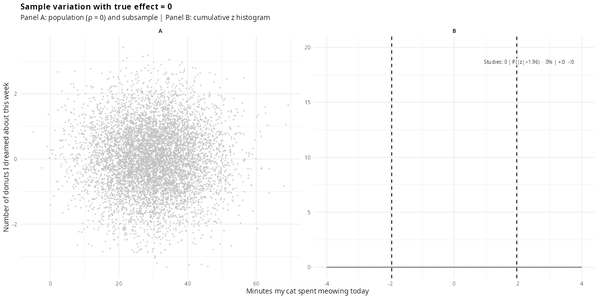
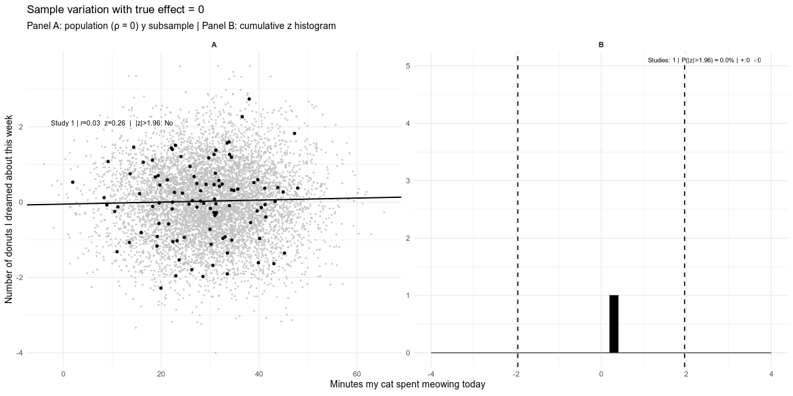
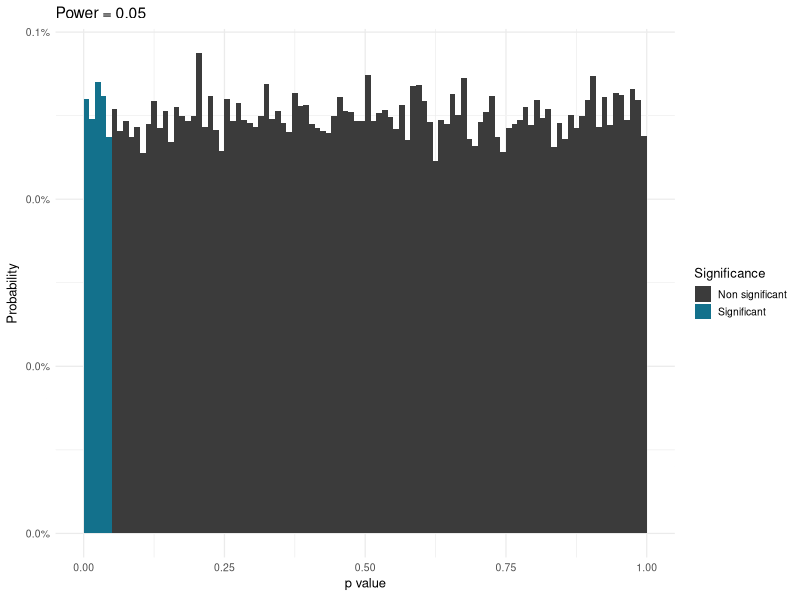
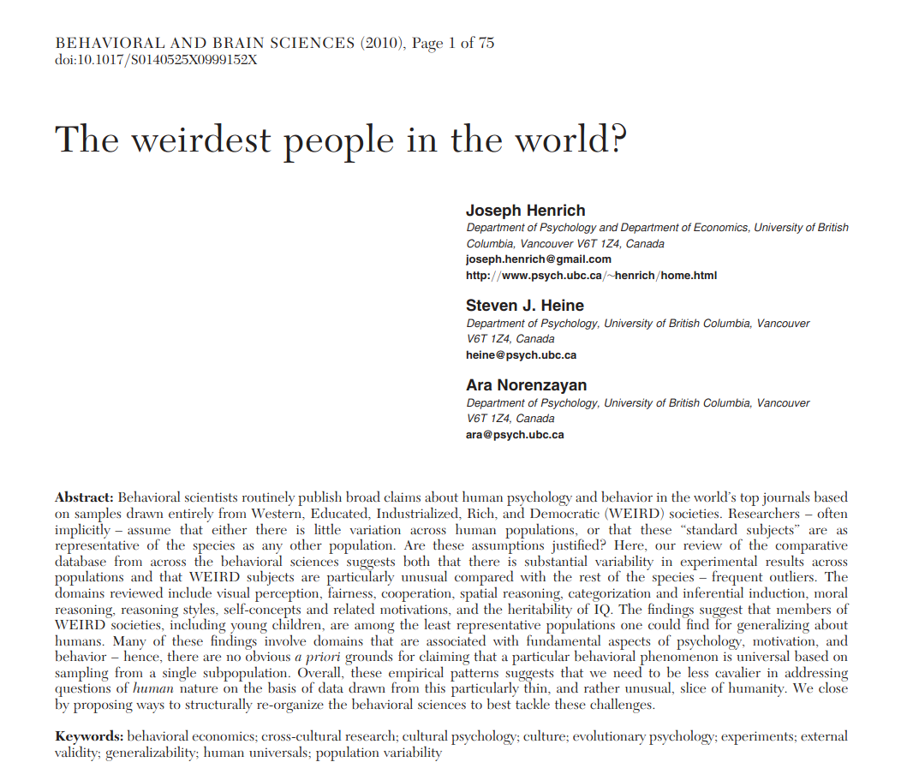
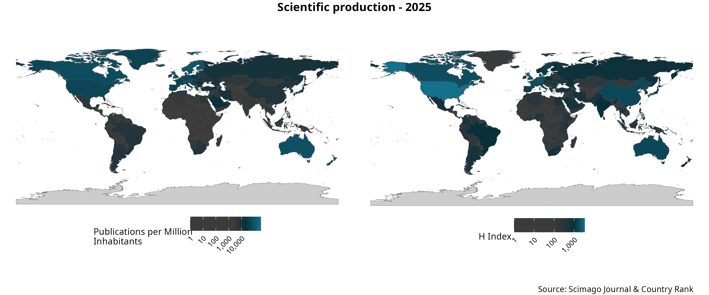

## 📲 Access the Slides Online

::: {style="text-align: center;"}
{width="45%"}\
[jdleongomez.github.io/unb-2026/open-science/](https://jdleongomez.github.io/unb-2026/open-science/){style="font-size: 70%;"}
:::

------------------------------------------------------------------------

## Outline

1.  **The Reproducibility Crisis**\
    The replication crisis, questionable research practices, and incentive structures.

2.  [**A Global Challenge**\
    Unequal access to reading and producing science, and where Brazil and Latin America stand.]{.fragment}

3.  [**What is Open Science?**\
    Definitions, motivation, and the pillars of open research practice.]{.fragment}

4.  [**Preregistration**\
    What it is, how it works, and why it improves research transparency.]{.fragment}

5.  [**Registered Reports**\
    A peer-review model that shifts the focus to study design and rigour.]{.fragment}

# Part 1: The Reproducibility Crisis {background-color="#2c3e50"}

------------------------------------------------------------------------

### 1.0 How is scientific knowledge actually built? {auto-animate="true"}

How do we know if two things are really related?

::: {.fragment .fade-in style="margin-top: 30px; font-size: 0.8em;"}
[Does my cat's meowing predict how many donuts I dream about?]{.is-accent}
:::

::: {.fragment .fade-in style="margin-top: 30px; font-size: 0.8em; text-align: center;"}
{width="22%"}\
(this is Electra, my ["cat"]{.is-accent})
:::

------------------------------------------------------------------------

### 1.0 How is scientific knowledge actually built? {auto-animate="true"}

::: {style="font-size: 0.8em;"}
[Does my cat's meowing predict how many donuts I dream about?]{.is-accent}
:::

------------------------------------------------------------------------

### 1.0 How is scientific knowledge actually built? {auto-animate="true"}

::: {style="font-size: 0.8em;"}
[Does my cat's meowing predict how many donuts I dream about?]{.is-accent}
:::

------------------------------------------------------------------------

### 1.0 How is scientific knowledge actually built? {auto-animate="true"}

::: {style="font-size: 0.8em;"}
[Does my cat's meowing predict how many donuts I dream about?]{.is-accent}
:::

------------------------------------------------------------------------

### 1.0 What just happened? {auto-animate="true"}

::: {.fragment .fade-in}
There is [no real relationship]{.is-accent} between these two variables
:::

::: {.fragment .fade-in}
Yet, by chance alone, some simulated studies still come out "significant"
:::

::: {.fragment .fade-in style="font-size: 85%;"}
Now imagine that only the "significant" ones get submitted, reviewed, and published
:::

------------------------------------------------------------------------

### 1.0 Why is it so hard to produce knowledge we can trust? {auto-animate="true"}

::: {style="text-align: center;"}

:::

------------------------------------------------------------------------

### 1.0 Why is it so hard to produce knowledge we can trust? {auto-animate="true"}

::: {style="text-align: center;"}

:::

------------------------------------------------------------------------

### {auto-animate="true"}

::: poster
::: overline
Q: **What percentage of published findings in psychology are statistically significant?**
:::
:::

------------------------------------------------------------------------

### {auto-animate="true"}

::: poster
::: overline
Q: **What percentage of published findings in psychology are statistically significant?**
:::

::: title
[96%]{.is-accent}
:::
:::

------------------------------------------------------------------------

### 1.1 Can we trust the literature? {auto-animate="true"}

There are two options:

1.  We study effects with \>90% power and \>90% probability of being true.

------------------------------------------------------------------------

### 1.1 Can we trust the literature? {auto-animate="true"}

There are two options:

1.  We study effects with \>90% power and \>90% probability of being true.
2.  [There is massive publication bias.]{.fragment .accent-on-click}

------------------------------------------------------------------------

### 1.1 Can we trust the literature? {auto-animate="true"}

2.  [There is massive publication bias]{.is-accent} (across multiple disciplines).

{width="60%"}\
[[Source](https://x.com/cremieuxrecueil/status/1772765486935056893)]{style="font-size: 50%;"}

------------------------------------------------------------------------

### 1.2 The significance filter {auto-animate="true"}

{width="80%"}

------------------------------------------------------------------------

### 1.2 The significance filter {auto-animate="true"}

::::: columns
::: {.column width="50%"}
1.1 million z-values, medical research (1976–2019)

{width="400"}

[[van Zwet & Cator (2021)](https://doi.org/10.1111/stan.12241)]{style="font-size: 50%;"}
:::

::: {.column .fragment .fade-in width="50%"}
 Also found in PLOS ONE

{width="400"}
:::
:::::

------------------------------------------------------------------------

### 1.3 Ten threats, one root cause {auto-animate="true"}

::: poster
::: overline
Where do false positives come from?
:::
::: title
Almost every step of the pipeline can be [bent]{.is-accent} toward a "significant" result
:::
:::

------------------------------------------------------------------------

### 1.3 Ten threats, one root cause {auto-animate="true"}

[🧪 P-hacking]{.chip} [💡 HARKing]{.chip} [📦 Publication Bias]{.chip} [📏 Low Power]{.chip} [🔧 Flexible Pipelines]{.chip} [🧠 No Preregistration]{.chip} [🧾 Poor Reporting]{.chip} [📊 Selective Reporting]{.chip} [🔄 Data/Code Not Shared]{.chip} [🌐 Cultural Incentives]{.chip}

::: {.fragment .fade-in style="font-size: 80%; margin-top: 1em;"}
Two of these deserve a closer look
:::

------------------------------------------------------------------------

### 1.4 P-hacking {auto-animate="true"}

::: {.fragment .fade-in}
Trying multiple analyses until [*p* \< .05]{.is-accent}
:::

::: {.fragment .fade-in style="font-size: 90%;"}
Every extra test, covariate, or exclusion rule you try (and don't report) inflates the real Type I error rate, silently
:::

------------------------------------------------------------------------

### 1.5 HARKing {auto-animate="true"}

*H*ypothesising *A*fter the *R*esults are *K*nown

------------------------------------------------------------------------

### 1.5 HARKing {auto-animate="true"}

::: {.fragment .fade-in style="font-size: 85%;"}
It turns an exploratory finding into something that [looks]{.is-accent} like a confirmed prediction
:::

------------------------------------------------------------------------

### 1.6 The common thread {auto-animate="true"}

::: poster
::: overline
It's not (only) bad actors
:::

::: title
Most of this happens through [ordinary, well-intentioned]{.is-accent} choices, made *after* seeing the data
:::
:::

------------------------------------------------------------------------

### 1.6 The four horsemen of the reproducibility apocalypse {auto-animate="true"}

# Part 2: A Global Challenge {background-color="#2c3e50"}

------------------------------------------------------------------------

### 2.1 It's not just about *replicating* findings {auto-animate="true"}

::: {.fragment .fade-in}
It's also about [who gets to read science, and who gets to produce it]{.is-accent}
:::

------------------------------------------------------------------------

### 2.2 Unequal access to knowledge {auto-animate="true"}

**Q:** How much does it typically cost to read a single paywalled article?

------------------------------------------------------------------------

### 2.2 Unequal access to knowledge {auto-animate="true"}

**Q:** How much does it typically cost to read a single paywalled article?\
**A:** [US$30–50]{style="font-size: 150%;" .is-accent}

::: {.fragment .fade-in style="font-size: 80%;"}
For a single paper. Not a subscription, not a journal, one article.
:::

------------------------------------------------------------------------

### 2.2 Unequal access to knowledge {auto-animate="true"}

{width="75%"}

[Nature, on the cost of scientific paywalls]{style="font-size: 50%;"}

------------------------------------------------------------------------

### 2.3 Unequal access to *producing* knowledge {auto-animate="true"}

::: {.fragment .fade-in}
Most psychological science is built on samples from [WEIRD]{.is-accent} societies
:::

------------------------------------------------------------------------

### 2.3 Unequal access to *producing* knowledge {auto-animate="true"}

{width="70%"}

::: {.fragment .fade-in style="font-size: 75%;"}
**W**estern, **E**ducated, **I**ndustrialised, **R**ich, **D**emocratic — [Henrich et al. (2010)](https://doi.org/10.1017/S0140525X0999152X)
:::

------------------------------------------------------------------------

### 2.4 Where does published science come from? {auto-animate="true"}

**Q:** What share of the world's scientific output do you think comes from Latin America?

------------------------------------------------------------------------

### 2.4 Where does published science come from? {auto-animate="true"}

{width="100%"}

[Data: SCImago Journal & Country Rank]{style="font-size: 50%;"}

------------------------------------------------------------------------

### 2.5 Two different bottlenecks {auto-animate="true"}

::::: columns
::: {.column width="50%"}
**Reading science**

::: {.fragment .fade-in}
-   Subscriptions and paywalls
-   Excludes readers without institutional access
:::
:::

::: {.column width="50%"}
**Producing science**

::: {.fragment .fade-in}
-   Article Processing Charges (Gold OA)
-   Excludes authors without funding to pay them
:::
:::
:::::

------------------------------------------------------------------------

### 2.5 Two different bottlenecks {.center}

::: poster
::: overline
The uncomfortable part
:::

::: title
Gold Open Access doesn't remove the barrier.\
It just moves it from [the reader]{.is-accent} to [the author]{.is-accent}.
:::
:::

------------------------------------------------------------------------

### 2.6 Not all Open Access is the same {auto-animate="true"}

| Model | Who pays | Who is excluded |
|----|----|----|
| **Closed** | Reader (subscription) | Readers without institutional access |
| **Gold OA** | Author (APC, often US\$1,000–3,000+) | Authors without funding |
| **Green OA** | No one | (self-archived preprint/postprint) |
| **Diamond OA** | No one | (community/institution-funded) |

------------------------------------------------------------------------

### 2.7 Brazil: a regional leader {auto-animate="true"}

::: {.fragment .fade-in}
-   Home to **SciELO**, one of the largest Open Access publishing infrastructures in the world
:::

::: {.fragment .fade-in}
-   **CAPES** and national policy have pushed Open Access for over a decade
:::

::: {.fragment .fade-in}
-   The [most mature and robust]{.is-accent} academic ecosystem in Latin America
:::

::: {.fragment .fade-in}
-   But the regional gap in *who produces* high-impact science remains
:::

------------------------------------------------------------------------

### 2.8 So what can we actually do about it? {auto-animate="true"}

::: {.fragment .fade-in}
The good news: the solutions that fix the reproducibility crisis are [often the same ones]{.is-accent} that lower these barriers
:::

::: {.fragment .fade-in style="font-size: 85%;"}
[Green OA]{.chip} [Preprints]{.chip} [Preregistration]{.chip} [Registered Reports]{.chip}
:::

::: {.fragment .fade-in style="font-size: 85%;"}
None of them require an APC, a paywall, or a well-funded lab
:::

# Part 3: What is Open Science? {background-color="#2c3e50"}

------------------------------------------------------------------------

### What do we mean by "Open Science"? {auto-animate="true"}

**Open Science** is the movement to make the process and products of research (data, code, materials, and publications) openly accessible, transparent, and reusable.

::: {.fragment .fade-in}
Not a single practice, but a set of **principles** that can be applied at every stage of the research cycle: from planning a study to sharing its results.
:::

------------------------------------------------------------------------

### Why does this matter? {auto-animate="true"}

::: {.fragment}
-   Science is meant to be **self-correcting**; but correction requires that others can check, reuse, and build on our work
:::

::: {.fragment .fade-in}
-   Closed research is **inefficient**: it duplicates effort and slows discovery
:::

::: {.fragment .fade-in}
-   Public funding and public trust create an **obligation** to share what we produce
:::

------------------------------------------------------------------------

### The Pillars of Open Science

::::: columns
::: {.column width="50%"}
::: {.fragment .fade-in}
📂 **Open Data**: sharing the raw data behind a finding
:::

::: {.fragment .fade-in}
💻 **Open Code**: sharing the analysis scripts that produced the results
:::

::: {.fragment .fade-in}
📄 **Open Access**: publishing so anyone can read the paper, not just those at
well-funded institutions
:::
:::

::: {.column width="50%"}
::: {.fragment .fade-in}
🧰 **Open Materials**: sharing stimuli, questionnaires, and protocols
:::

::: {.fragment .fade-in}
📝 **Preregistration**: stating the plan *before* seeing the data
:::
:::
:::::

------------------------------------------------------------------------

### Why this matters for psychology and behavioural sciences

::: {.fragment .fade-in}
-   Psychology has been at the centre of the reproducibility conversation for over a decade
:::

::: {.fragment .fade-in}
-   Our data are often costly to collect (human participants, time, ethics approval); reuse and transparency multiply their value
:::

::: {.fragment .fade-in}
-   Open practices are increasingly **expected** by journals, funders, and evaluation committees
:::

::: {.fragment .fade-in}
-   [Open Science]{.is-accent} is the field's structured response to everything you've just seen — the rest of this talk covers two of its most concrete tools
:::

# Part 4: Preregistration {background-color="#2c3e50"}

------------------------------------------------------------------------

### 4.1 What is preregistration? {auto-animate="true"}

**Preregistration** is the act of specifying your research plan *before* conducting the study.

::: {.fragment .fade-in}

:::

------------------------------------------------------------------------

### 4.1 What is preregistration? {auto-animate="true"}

::: {.fragment .fade-in}
-   Define your research question and hypotheses **before** collecting data
:::

::: {.fragment .fade-in}
-   Specify your analysis plan and study design in advance
:::

::: {.fragment .fade-in}
-   Clearly link your hypotheses to your planned methods and outcomes
:::

------------------------------------------------------------------------

### 4.1 Why preregister? {auto-animate="true"}

::: {.fragment .fade-in}
-   Enhances **credibility** by making your intentions transparent
:::

::: {.fragment .fade-in}
-   Helps you plan better and avoid analytical drift
:::

::: {.fragment .fade-in}
-   Keeps all your design and analysis decisions in one place, even before data collection!
:::

------------------------------------------------------------------------

### 4.1 Can I still explore my data? {auto-animate="true"}

::: {.fragment .fade-in}
Absolutely! Preregistration doesn't ban exploration; it just draws a clear line between
**confirmatory** and **exploratory** analyses
:::

::: {.fragment .fade-in}
-   You can deviate from your plan. Just be upfront and explain why
:::

::: {.fragment .fade-in}
-   The goal isn't rigidity, but **transparency**
:::

------------------------------------------------------------------------

### 4.2 Key Benefits of Preregistration

| Effect | Description |
|----|----|
| **Transparency** | Public hypotheses and plans [[Toth et al., 2019](https://doi.org/10.5465/AMBPP.2019.17182ABSTRACT)] |
| **Less Bias** | Encourages reporting of null results [[Marsden et al., 2022](https://doi.org/10.1111/add.15819)] |
| **Clearer Claims** | Exploratory ≠ confirmatory [[Dewitte et al., 2021](https://doi.org/10.21428/1192f2f8.52d90db5)] |
| **Better Quality** | Plans include power, exclusion criteria, etc. [[Ioannidis et al., 2022](https://doi.org/10.1016/j.mbs.2022.108782)] |
| **Credibility** | Deviations from the plan are explicit [[Waldron et al., 2022](https://doi.org/10.1038/s41386-022-01418-x)] |
| **Easier Review** | Reviewers can see the original plan [[Toth et al., 2019](https://doi.org/10.5465/AMBPP.2019.17182ABSTRACT)] |

------------------------------------------------------------------------

### 4.3 How does it work in practice?

::: {.fragment .fade-in}
-   Write your hypotheses, design, and analysis plan in a structured template (e.g.
    **AsPredicted**, or a full **OSF** template)
:::

::: {.fragment .fade-in}
-   Submit it to a public registry (for example [**OSF Registries**](https://osf.io/registries))
:::

::: {.fragment .fade-in}
-   The registry **time-stamps** the plan and issues a permanent, citable **DOI**
:::

::: {.fragment .fade-in}
-   You can make it public immediately, or place it under a temporary **embargo**
:::

::: {.fragment .fade-in}
-   Only *then* do you collect your data
:::

------------------------------------------------------------------------

### 4.4 Preregistration vs. Registered Reports {.center background-color="#1A1A2E"}

::: {style="font-size: 90%;"}
This distinction trips people up constantly: here it is, side by side.
:::

::::: columns
::: {.column width="50%"}
**Preregistration**

::: {.fragment .fade-in}
-   You register your plan yourself
:::

::: {.fragment .fade-in}
-   **No peer review** of the plan before data collection
:::

::: {.fragment .fade-in}
-   Publication is **not guaranteed**: you still submit and compete after the study is done
:::

::: {.fragment .fade-in}
-   A record that keeps you honest and makes deviations visible
:::
:::

::: {.column width="50%"}
**Registered Reports**

::: {.fragment .fade-in}
-   The plan is **peer-reviewed** by a journal or platform
:::

::: {.fragment .fade-in}
-   Reviewers can improve the design **before** data exist
:::

::: {.fragment .fade-in}
-   Publication is **provisionally guaranteed** if the plan is followed
    (in-principle acceptance)
:::

::: {.fragment .fade-in}
-   A publishing *format*, built on top of preregistration
:::
:::
:::::

::: {.fragment .fade-in}
[Every Registered Report is preregistered. Not every preregistration becomes a Registered
Report.]{style="font-size: 80%;"}
:::

------------------------------------------------------------------------

### 4.5 Limitations & Considerations

::: {.fragment .fade-in}
-   Not a cure-all: vague preregistrations still allow bias
    [[Waldron et al., 2022](https://doi.org/10.1038/s41386-022-01418-x)]
:::

::: {.fragment .fade-in}
-   Some concerns: added bureaucracy, misuse, or an overly rigid view of exploratory analysis
    [[Toth et al., 2019](https://doi.org/10.5465/AMBPP.2019.17182ABSTRACT)]
:::

::: {.fragment .fade-in}
-   Not every research type benefits equally, but the practice is broadly beneficial
    [[Dewitte et al., 2021](https://doi.org/10.21428/1192f2f8.52d90db5)]
:::

# Part 5: Registered Reports {background-color="#2c3e50"}

------------------------------------------------------------------------

### 5.1 How Registered Reports differ (reiterated) {auto-animate="true"}

::: {.fragment .fade-in}
-   Peer review happens **before** data collection, not after
:::

::: {.fragment .fade-in}
-   If accepted in principle, publication is guaranteed regardless of the results
:::

::: {.fragment .fade-in}
-   Because methods are peer-reviewed up front, designs tend to be **stronger**
:::

------------------------------------------------------------------------

### 5.2 The Registered Reports pipeline

::::: columns
::: {.column width="33%" .fragment .fade-in}
**Stage 1**

Submit introduction, hypotheses, and methods (*before* collecting data)
:::

::: {.column width="33%" .fragment .fade-in}
**In-Principle Acceptance (IPA)**

Reviewers evaluate the *plan*. If sound, the journal commits to publish
:::

::: {.column width="33%" .fragment .fade-in}
**Stage 2**

Collect the data, run the pre-registered analyses, and submit the full report
:::
:::::

------------------------------------------------------------------------

### 5.3 What goes into a Stage 1 submission? {auto-animate="true"}

::: {style="font-size: 90%;"}
Almost every RR template (PCI RR included) asks you to fill in some version of the same
**design table**. Everything in it is written **before** you collect a single data point.
:::

------------------------------------------------------------------------

### 5.3 The design table {auto-animate="true"}

::: {style="font-size: 80%;"}
| Component | What you specify |
|----|----|
| **Question** | The research question, stated precisely enough to be testable |
| **Hypothesis** | The specific, directional prediction(s) you are testing |
| **Sampling Plan** | How the data will be collected, and a justified sample size (e.g. an *a priori* power analysis) |
| **Analysis Plan** | The exact statistical test(s), and the criteria that would count as support or non-support |
| **Rationale for the test's sensitivity** | Why this design and sample size are sensitive enough to actually detect the effect, if it exists |
| **Interpretation given different outcomes** | What each possible result — supportive, non-supportive, ambiguous — would mean, decided *before* seeing the data |
| **Theory that could be shown wrong** | Which theoretical claim the outcomes could genuinely falsify — a real test needs a real chance of failing |
:::

::: {.fragment .fade-in style="font-size: 85%;"}
This is what reviewers evaluate at Stage 1: not whether the result will be "interesting", but
whether the plan is **sound** — and whether it could actually prove the theory wrong.
:::

------------------------------------------------------------------------

### 5.3 The design table, as PCI RR asks for it {auto-animate="true"}

{width="100%"}

[Source: [PCI Registered Reports](https://rr.peercommunityin.org) — Stage 1 submission
template]{style="font-size: 50%;"}

------------------------------------------------------------------------

### 5.4 Key Benefits

| Effect | Description |
|----|----|
| **Reduces Publication Bias** | Acceptance is based on design, not results [[Chambers & Tzavella, 2021](https://doi.org/10.1038/s41562-021-01193-7)] |
| **Methodological Rigour** | Early peer review strengthens design and analysis plans [[Soderberg et al., 2021](https://doi.org/10.1038/s41562-021-01142-4)] |
| **Transparency** | Protocols are pre-specified and openly available [[Nosek et al., 2014](https://doi.org/10.1027/1864-9335/A000192)] |
| **Reduces Questionable Practices** | Limits p-hacking and HARKing [[Lakens et al., 2024](https://doi.org/10.1080/2833373x.2024.2376046)] |
| **Constructive Early Feedback** | Expert input on design *before* data collection [[Kiyonaga et al., 2019](https://doi.org/10.1016/j.tins.2019.07.003)] |
| **Values Null Results** | Studies are published regardless of outcome [[Chambers et al., 2020](https://doi.org/10.1038/s41562-021-01193-7)] |

------------------------------------------------------------------------

### 5.5 The PCI RR model {auto-animate="true"}

{width="70%"}

------------------------------------------------------------------------

### 5.5 The PCI RR model {auto-animate="true"}

::: {style="font-size: 75%;"}
**Peer Community In Registered Reports (PCI RR)** is a free, non-profit platform for reviewing
and recommending Registered Reports.
:::

::: {.fragment .fade-in style="font-size: 75%;"}
-   Authors submit a Stage 1 manuscript → receive peer review → upon **in-principle
    acceptance**, they can:
:::

::: {.fragment .fade-in style="font-size: 75%;"}
-   Publish the Stage 2 report in any of **100+ PCI RR-friendly journals**, or
:::

::: {.fragment .fade-in style="font-size: 75%;"}
-   Simply use the PCI RR recommendation itself (free and citable)
:::

::: {.fragment .fade-in style="font-size: 75%;"}
-   Ideal if you want a **journal-agnostic** process, more control over where you publish,
    and fully **transparent, open peer review**
:::

------------------------------------------------------------------------

### 5.5 The PCI RR model — the full process {auto-animate="true"}

{width="95%"}

::: {style="font-size: 60%;"}
Note the two checkpoints where a submission can fail to advance (Stage 1 and Stage 2 criteria)
— peer review is real, not a formality. Once recommended, the preprint is a valid, citable
output on its own, even before (or instead of) journal submission.
:::

------------------------------------------------------------------------

### 5.6 Why this is especially valuable for grad students

::: {.fragment .fade-in}
-   **No article processing charge (APC)** through the PCI RR recommendation route
:::

::: {.fragment .fade-in}
-   Publication is essentially **guaranteed** once the plan is accepted, regardless of
    whether the results are "exciting"
:::

::: {.fragment .fade-in}
-   Expert peer review improves your **design** while you can still change it, not after
    the data are already collected
:::

::: {.fragment .fade-in}
-   Reduces the pressure to produce a significant result to be publishable
:::

------------------------------------------------------------------------

### 5.7 Real-World Adoption

::: {.fragment .fade-in}
-   ✅ Over **300 journals** now offer Registered Reports
:::

::: {.fragment .fade-in}
-   🧪 Used across disciplines: **psychology**, **ecology**, **medicine**, **economics**,
    and more
:::

::: {.fragment .fade-in}
-   💬 Growing support from funders and institutions
:::

::: {.fragment .fade-in}
-   🌍 PCI RR offers a global, open-access alternative to journal-based review
:::

[Sources: cos.io, PCI RR, [Chambers & Tzavella, 2021](https://doi.org/10.1038/s41562-021-01193-7)]{style="font-size: 60%;"}

------------------------------------------------------------------------

### 5.7 Real-World Adoption: the effect on the record

::::: columns
::: {.column .fragment .fade-in width="50%"}
{width="400"}
:::

::: {.column .fragment .fade-in width="50%"}
{width="400"}\
[[Scheel et al., 2021](https://doi.org/10.1177/25152459211007467)]{style="font-size: 50%;"}
:::
:::::

------------------------------------------------------------------------

### 5.8 Are Registered Reports Always Appropriate?

::: {.fragment .fade-in}
-   Not ideal for purely **exploratory** or **rapid-response** studies
:::

::: {.fragment .fade-in}
-   Adds planning time and a peer-review step before data collection begins
:::

::: {.fragment .fade-in}
-   But most **confirmatory** studies (the majority of grad-student theses) benefit from
    this model
:::

------------------------------------------------------------------------

### 5.9 What if I already have some data?

::: {.fragment .fade-in}
-   PCI RR recognises a range of **bias-control levels**, not just brand-new data — secondary
    analyses of existing data are still eligible
:::

::: {.fragment .fade-in}
-   The less "untouched" your data are, the more safeguards you need (e.g. a blinded analyst,
    a stricter statistical threshold) to reach a given level — but it's still possible
:::

::: {.fragment .fade-in}
-   Plan your study and submit **before collecting any data**, and you automatically qualify
    for the **highest level** — the strongest form of evidence this model can produce
:::

------------------------------------------------------------------------

### 5.9 Levels of bias control recognised by PCI RR

{width="85%"}

[Source: [PCI Registered Reports](https://rr.peercommunityin.org) — for reference when you're
ready to submit]{style="font-size: 50%;"}

# Closing: How to Start {background-color="#2c3e50"}

------------------------------------------------------------------------

### Practical First Steps

::: {.fragment .fade-in}
1.  Pick a study you're planning that tests a clear hypothesis
:::

::: {.fragment .fade-in}
2.  Fill in a **design table** for it — Question, Hypothesis, Sampling Plan, Analysis Plan,
    and Interpretation for each outcome — *before* collecting data (see §5.3)
:::

::: {.fragment .fade-in}
3.  Try a simple preregistration first (e.g. **AsPredicted**, via OSF)
:::

::: {.fragment .fade-in}
4.  For your next confirmatory study, consider submitting a Stage 1 Registered Report to
    [PCI RR](https://rr.peercommunityin.org)
:::

::: {.fragment .fade-in}
5.  Ask your supervisor or lab whether preregistration could become a standard step in
    your group's workflow
:::

------------------------------------------------------------------------

### Key Resources

&nbsp;&nbsp;&nbsp;

-   **OSF Registries**: <https://osf.io/registries>
-   **PCI Registered Reports**: <https://rr.peercommunityin.org>
-   **Center for Open Science**: <https://www.cos.io>

------------------------------------------------------------------------

## Summary

-   Many threats to replicability are **systemic, but solvable**
-   **Preregistration** helps you plan better, interpret results honestly, and build
    credibility
-   **Registered Reports** realign incentives and put peer review where it can do the most
    good: before the data exist
-   Tools like OSF and PCI RR make both accessible and free

------------------------------------------------------------------------

## Questions? {.center}

Thank you for your attention! Happy to discuss, critique, or hear about your own experience
with these practices.

------------------------------------------------------------------------

## Thank you! {.center}

::::: columns
::: {.column width="50%"}
{width="60%"}
:::

::: {.column width="50%"}
  **Juan David Leongómez** [PhD, MSc]{style="font-size: 50%;"} 
[jleongomez\@unbosque.edu.co](mailto:jleongomez@unbosque.edu.co){style="font-size: 70%;"}
:::
:::::
